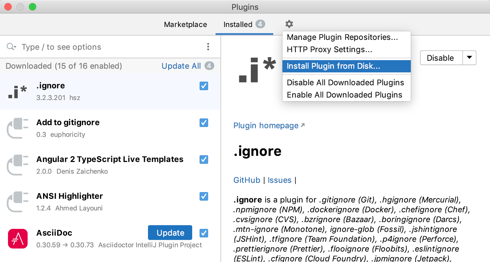

Codever Snippets - Intellij Plugin
---

Save ans search snippets from IntelliJ IDEs on [Codever](https://www.codever.dev) easily.

> [Register](https://www.codever.dev/register) an account first and follow the [howto](https://www.codever.dev/howto) guides
> to help you get started

### Save snippet

 **Select code snippet** > **right click** or **Ctrl+Shift+A** (**Cmd+Shift+A** on Mac) > **Save to Codever** :
 

### Search snippets

**Right click** or **Ctrl+Shift+P** (**Cmd+Shift+P** on Mac) > **Search on Codever**:

> You can select text in editor, which will be used as **initial value** in input dialog

## Install
Open the project in IntelliJ 

## Deployment
The plugin DevKit provides a simple way to package plugins so we can install and distribute them.
 Right-click the plugin project and select **“Prepare plugin module for Deployment”** (last entry in menu).
  This will generate a JAR file inside the project directory - `codever-intellij-plugin.jar`
  which you can install for testing from local disk:
  
  

## Publish to JetBrains repository

**Upload Update** in the [overview page](https://plugins.jetbrains.com/plugin/14456-codever-snippets) of the plugin
