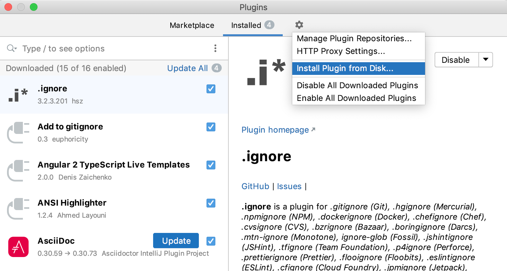

# Codever Notes - IntelliJ Plugin
---

Save selected code as Markdown notes and search your Codever notes directly from recent IntelliJ IDEs.

> [Register](https://www.codever.dev/register) an account first and follow the [Codever HowTo guides](https://www.codever.dev/howto/notes) to get started.

## Features

### Save a note

**Select code** > **right click** or **Ctrl+Shift+A** (**Cmd+Shift+A** on Mac) > **Save to Codever**:


The selected code is sent to Codever as a Markdown fenced code block. The plugin also sends the language, file, project, and source-location metadata when it is available in the IDE.

With the IDE's Jupyter plugin enabled, both actions are also available in notebook cell editor context menus. Select text inside a code cell or a Markdown cell in edit mode, then right-click the selection. Selecting a whole cell without selecting its text does not enable **Save to Codever**. This saves the selected text as a Markdown note, not the whole notebook or rendered output.

### Search notes

**Right click** or **Ctrl+Shift+P** (**Cmd+Shift+P** on Mac) > **Search on Codever**:

> You can select text in the editor; it is used as the initial value in the search dialog.


## Development

This is a standalone IntelliJ plugin repository. A checkout may be placed next to or inside the Codever web application's working directory for convenient access by developers and coding agents, but it is not part of the Codever monorepo and has its own history, build, versioning, and release process.

The plugin uses the IntelliJ Platform Gradle Plugin 2.x and targets IntelliJ IDEA 2025.2 or newer.

### Prerequisites

Install this tool manually before testing:

- Java Development Kit (JDK) 21, with `JAVA_HOME` pointing to it and `java --version` working in the shell.

The repository includes the Gradle Wrapper configured for Gradle 9.0.0. You do not need to install Gradle separately. On the first invocation, the wrapper downloads its configured Gradle distribution into the user-level Gradle cache.

Open the `codever-intellij-plugin` directory as a Gradle project in IntelliJ IDEA. To launch a development IDE with the plugin installed, run:

```bash
./gradlew runIde
```

On Windows, use:

```bat
gradlew.bat runIde
```

## Build and install locally

Build the plugin ZIP with:

```bash
./gradlew clean buildPlugin
```

The package is generated in `build/distributions/`. To install it in an existing IDE:

1. Open **Settings/Preferences > Plugins**.
2. Open the gear menu and select **Install Plugin from Disk...**.
3. Select the ZIP from `codever-intellij-plugin/build/distributions/`.
4. Restart the IDE when prompted.



The plugin currently declares compatibility with build `252` and later. The build target and compatibility range are configured in [`build.gradle.kts`](build.gradle.kts) and [`plugin.xml`](src/main/resources/META-INF/plugin.xml).

### Local smoke test

1. From this directory, run `./gradlew runIde` to start a disposable IntelliJ instance with the plugin loaded.
2. Sign in to Codever in the launched IDE's browser if required.
3. Open a project and a source file, select code, and use **Save to Codever**. Confirm that a note is created at Codever with the selected code as a Markdown fenced block.
4. Use **Search on Codever**, enter a query containing spaces or punctuation, and confirm that the browser opens the notes search correctly.
5. With Jupyter enabled, open an `.ipynb` file, select text inside a code cell, and right-click the selection. Confirm **Save to Codever** and **Search on Codever** each appear once, and that both dialogs use the selection correctly. Repeat in a Markdown cell in edit mode. Without a text selection, Save should be hidden and Search should remain available.
6. Disable Jupyter and restart the disposable IDE. Confirm Codever still loads and the source-file and console context menu actions work without missing-group errors. Re-enable Jupyter after this check.
7. Close the disposable IDE and inspect the console for errors. For an installable-package check, run `./gradlew clean buildPlugin` and install the resulting ZIP in a separate local IntelliJ installation.

The plugin opens Codever production URLs, so the smoke test requires network access and a Codever account. It does not require the Codever API or UI to be started locally.

## Publish to JetBrains Marketplace

Publishing requires a JetBrains Marketplace personal access token. Configure these environment variables in the shell or CI job:

- `PUBLISH_TOKEN` — JetBrains Marketplace publishing token
- `CERTIFICATE_CHAIN` — certificate chain used to sign the plugin
- `PRIVATE_KEY` — private key used to sign the plugin
- `PRIVATE_KEY_PASSWORD` — password for the private key

Build and sign the plugin, then publish it with:

```bash
./gradlew clean buildPlugin signPlugin publishPlugin
```

The `signPlugin` and `publishPlugin` tasks use the environment variables above. Do not commit certificates, private keys, passwords, or publishing tokens.

The existing Marketplace listing is available at [Codever on JetBrains Marketplace](https://plugins.jetbrains.com/plugin/14456-codever-snippets). The listing URL retains its historical `codever-snippets` slug, while the plugin UI and documentation now refer to Codever notes.
